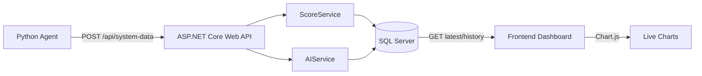
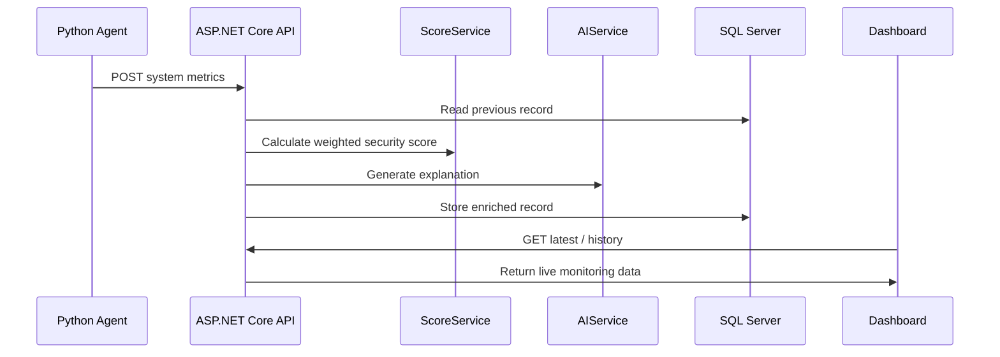

<h1 align="center">SysScore</h1>

<p align="center">
AI-supported security scoring and monitoring platform for Pardus/Linux systems.
</p>

<p align="center">
  
  
  
  
  
  
  
</p>

---

## Project Overview

SysScore is a graduation project designed to collect system metrics from a Pardus/Linux machine, calculate a professional security score, store historical monitoring data, visualize system health in a live dashboard, and explain score changes with an AI-supported explanation module.

The platform follows an end-to-end monitoring flow:

```text
Python Agent -> ASP.NET Core Web API -> SQL Server -> Frontend Dashboard
                                      |
                                      -> AI / Rule-based Explanation
```

The system is built with a safe fallback-first design. Even if the optional local LLM integration is unavailable, the backend continues to calculate scores and generate deterministic rule-based explanations.

---

## Key Features

### System Monitoring Agent

The Python agent collects live Linux system metrics using `psutil`:

* CPU usage
* RAM usage
* Disk usage
* Swap usage
* Disk free space
* Process count
* High CPU process count
* High memory process count
* Network connection count
* Listening port count
* System uptime
* Boot time
* Temporary/cache/trash file statistics
* Largest unnecessary file samples

The agent sends data to the backend through REST API calls at a configurable polling interval.

### Professional Security Scoring

The security score is no longer based only on CPU/RAM/Disk usage. SysScore uses a weighted, rule-based scoring model:

| Risk Area | Signals |
| --- | --- |
| Resource Pressure | CPU, RAM, disk, swap |
| Process Anomaly | Total process count, high CPU/memory process count |
| Network Exposure | Listening ports, active connections |
| Storage Hygiene | Temporary/cache/trash count and total size |
| Trend Risk | Sudden increase compared with previous records |

The score stays in the `0-100` range:

```text
SecurityScore = 100 - weightedRiskPenalty
```

This makes the score more explainable and closer to a real security monitoring model.

### AI Explanation Module

Each system record receives an explanation.

Supported behavior:

* Deterministic fallback explanation
* Optional Ollama local LLM enhancement
* Safe fallback if Ollama is unavailable
* Score decrease interpretation
* Resource, process, network and storage hygiene explanations

Example fallback explanation:

```text
Temporary, cache, or trash files are accumulating and should be reviewed for storage hygiene.
The number of listening ports is higher than expected and exposed services should be reviewed.
```

### Live Dashboard

The frontend dashboard provides:

* Live security score panel
* AI explanation panel
* CPU, RAM, disk and process cards
* Swap, disk free, uptime and boot time cards
* Listening ports and network connection metrics
* High CPU / high memory process indicators
* Chart.js resource usage graph
* Chart.js security score trend graph
* Scrollable recent records table
* Storage Hygiene panel for unnecessary files
* Dark, responsive, security-themed UI

---

## Architecture



### Data Flow



---

## Project Structure

```text
SysScore/
│── SysScore.sln
│── docker-compose.yml
│── README.md
│── LICENSE
│
├── agent/
│   ├── agent.py
│   └── requirements.txt
│
├── backend/
│   ├── Controllers/
│   │   └── SystemController.cs
│   ├── Data/
│   │   └── AppDbContext.cs
│   ├── Models/
│   │   └── SystemData.cs
│   ├── Services/
│   │   ├── ScoreService.cs
│   │   └── AIService.cs
│   ├── Migrations/
│   ├── Program.cs
│   ├── appsettings.json
│   └── SysScore.csproj
│
└── frontend/
    ├── index.html
    ├── styles.css
    ├── app.js
    ├── server.js
    ├── package.json
    └── package-lock.json
```

---

## Technologies Used

| Category | Technology |
| --- | --- |
| Agent | Python |
| System Metrics | psutil |
| HTTP Client | requests |
| Backend | ASP.NET Core Web API |
| Runtime | .NET 8 |
| ORM | Entity Framework Core |
| Database | Microsoft SQL Server |
| Container | Docker |
| Frontend | HTML, CSS, JavaScript |
| Charts | Chart.js |
| AI Explanation | Rule-based fallback, optional Ollama |
| License | MIT |

---

## API Endpoints

| Method | Endpoint | Description |
| --- | --- | --- |
| `POST` | `/api/system-data` | Receives system metrics, calculates score, stores record |
| `GET` | `/api/system-data/latest` | Returns the latest monitoring record |
| `GET` | `/api/system-data/history` | Returns historical monitoring records |

Example payload:

```json
{
  "cpuUsage": 12.5,
  "ramUsage": 43.1,
  "diskUsage": 16.3,
  "swapUsage": 0.9,
  "diskFreeGb": 72.9,
  "processCount": 290,
  "highCpuProcessCount": 0,
  "highMemoryProcessCount": 0,
  "networkConnectionCount": 74,
  "listeningPortCount": 7,
  "systemUptimeSeconds": 14049,
  "bootTime": "2026-05-15T18:14:18Z",
  "unnecessaryFileCount": 5353,
  "unnecessaryFileSizeMb": 237.01,
  "unnecessaryFileLocations": "/tmp, ~/.cache, ~/.local/share/Trash/files",
  "largestUnnecessaryFiles": "10.6 MB /tmp/example.log"
}
```

---

## Installation and Running

### 1. Clone Repository

```bash
git clone https://github.com/AFurkanOcel/SysScore.git
cd SysScore
```

### 2. Start SQL Server

If Docker Compose is available:

```bash
docker compose up -d
```

If your system uses the legacy command:

```bash
docker-compose up -d
```

The SQL Server container uses:

```text
Server: localhost,1433
Database: SysScoreDb
User: sa
Password: SysScore_2026!
```

### 3. Apply Database Migrations

```bash
dotnet ef database update --project backend/SysScore.csproj --startup-project backend/SysScore.csproj
```

### 4. Run Backend API

```bash
dotnet run --project backend/SysScore.csproj --urls http://localhost:5070
```

Swagger:

```text
http://localhost:5070/swagger
```

### 5. Run Python Agent

Install Python dependencies:

```bash
pip install -r agent/requirements.txt
```

Run the agent:

```bash
python agent/agent.py
```

Optional configuration:

```bash
export SYSSCORE_API_URL=http://localhost:5070/api/system-data
export SYSSCORE_POLL_INTERVAL_SECONDS=5
python agent/agent.py
```

### 6. Run Frontend Dashboard

```bash
npm install --prefix frontend
npm start --prefix frontend
```

Dashboard:

```text
http://localhost:5173
```

---

## AI Configuration

Default configuration uses deterministic fallback explanations:

```json
"AI": {
  "UseOllama": false,
  "OllamaUrl": "http://localhost:11434/api/generate",
  "OllamaModel": "llama3.2",
  "TimeoutSeconds": 3
}
```

To enable optional Ollama support, set:

```json
"UseOllama": true
```

If Ollama is unavailable, SysScore continues to work with fallback explanations.

---

## Screenshots

Add screenshots after pushing the project to GitHub.

Recommended screenshots:

### Dashboard Overview

Add a screenshot showing the full dark dashboard, security score, metric cards and charts.

```text
Recommended filename: docs/screenshots/dashboard-overview.png
```

### Live Charts

Add a screenshot focused on the Chart.js resource usage and security score trend graphs.

```text
Recommended filename: docs/screenshots/live-charts.png
```

### Storage Hygiene Panel

Add a screenshot showing the temporary/cache/trash monitoring section and the scrollable unnecessary file list.

```text
Recommended filename: docs/screenshots/storage-hygiene.png
```

### Swagger API

Add a screenshot showing the available backend API endpoints in Swagger.

```text
Recommended filename: docs/screenshots/swagger-api.png
```

After uploading screenshots, you can embed them like this:

```markdown

```

---

## Security and Safety Notes

* The unnecessary file monitoring feature does not delete files.
* The agent only scans limited locations: `/tmp`, `~/.cache`, and `~/.local/share/Trash/files`.
* Permission errors during scanning are ignored safely.
* AI explanation failure does not stop backend processing.
* The system is intended for local monitoring and academic demonstration.

---

## Future Improvements

* More advanced anomaly detection
* Process whitelist/blacklist support
* Open port risk classification
* Failed login monitoring
* Firewall status monitoring
* Package update and patch status monitoring
* Role-based dashboard authentication
* Exportable reports
* Production-ready secret management

---

## Learning Outcomes

This project demonstrates:

* Multi-component system architecture
* Python system monitoring
* ASP.NET Core Web API development
* Entity Framework Core migrations
* SQL Server persistence with Docker
* Real-time dashboard design
* Chart.js visualization
* Rule-based security scoring
* AI-supported explanation design
* Safe fallback engineering

---

## Author

**A. Furkan Ocel**

---

## License

This project is licensed under the MIT License. See the [LICENSE](LICENSE) file for details.
