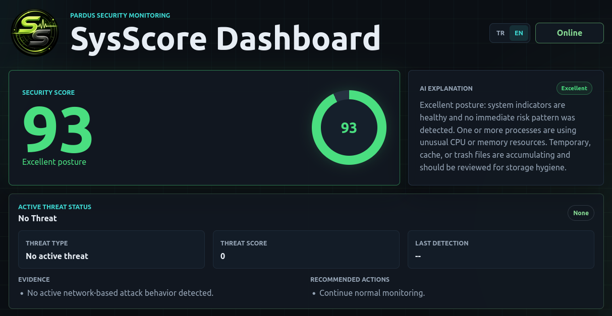
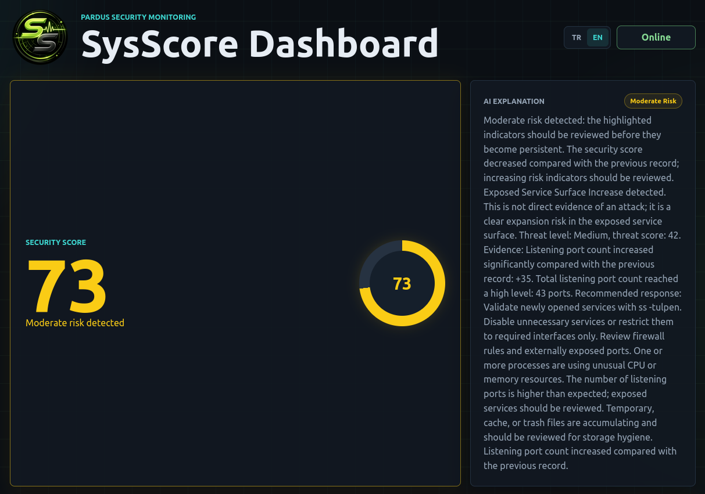
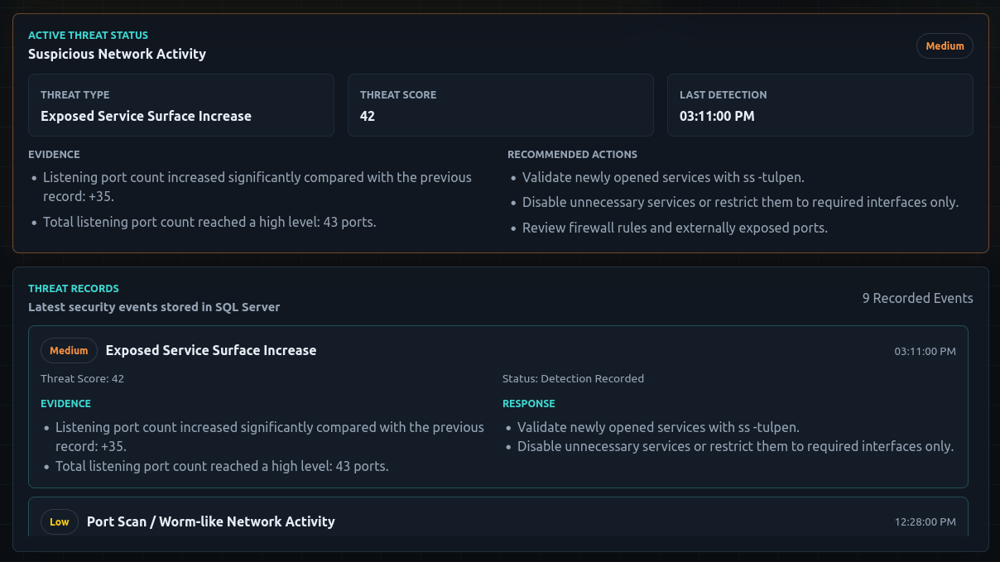
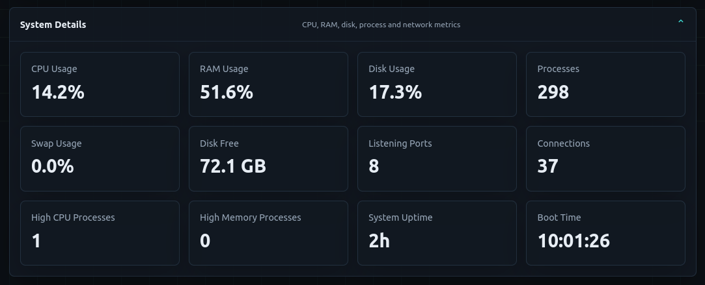
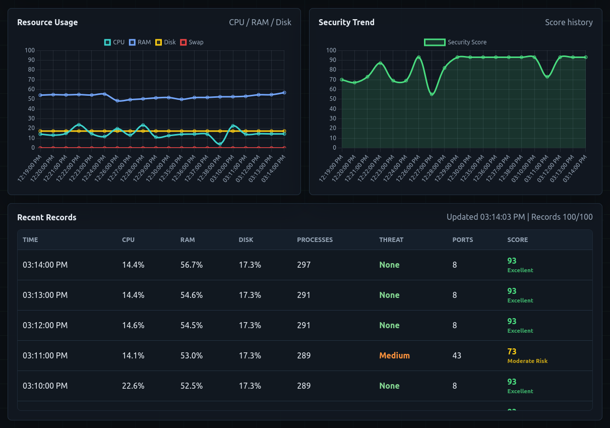
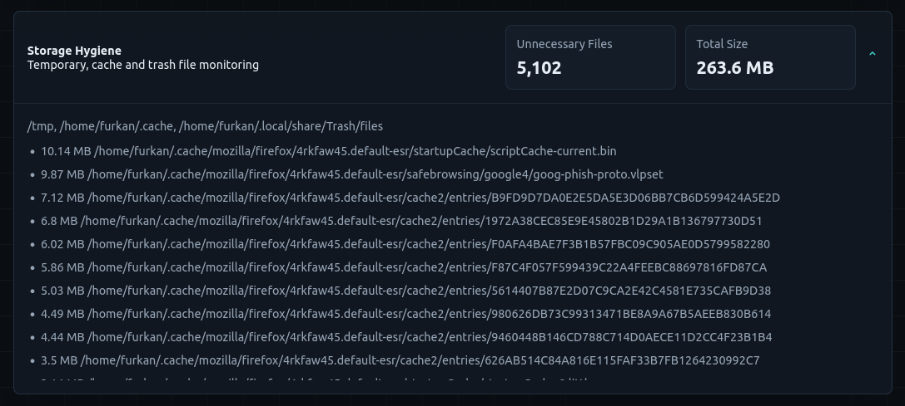
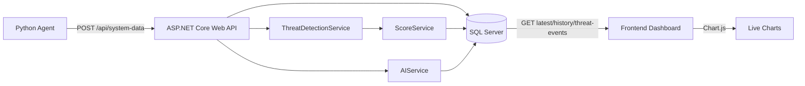
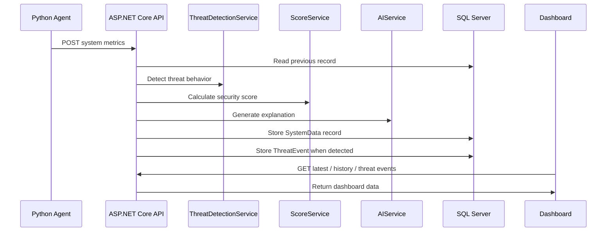

<h1 align="center">SysScore</h1>

<p align="center">
  
</p>

<p align="center">
AI-supported threat detection, security scoring and monitoring platform for Pardus/Linux systems.
</p>

<p align="center">
  
  
  
  
  
  
  
  
  
  
  
</p>

---

## Project Overview

SysScore is a graduation project designed for Pardus/Linux systems. It collects host and network telemetry with a lightweight Python agent, sends the data to an ASP.NET Core Web API, calculates an explainable security score, detects selected behavior-based security risks, stores historical records in SQL Server, and visualizes everything in a live dashboard.

The project is not an antivirus signature engine. It follows an IDS-style behavioral monitoring approach and focuses on two safe, demonstrable threat classes:

* **Port Scan / Worm-like Network Activity**
* **Exposed Service Surface Increase**

The platform follows an end-to-end monitoring flow:

```text
Python Agent -> ASP.NET Core Web API -> Threat Detection + Security Scoring -> SQL Server
                                      |
                                      -> AI / Rule-based Explanation -> Frontend Dashboard
```

The dashboard is Turkish by default for Pardus-focused usage and includes an English language toggle. The AI module is fallback-first: if the optional local Ollama integration is unavailable, deterministic rule-based explanations continue to work.

---

## Interface Preview

### Stable Security Score & Explanation

The dashboard shows a live security score, risk severity and AI-supported explanation. In stable conditions, the score remains high, the explanation confirms that no immediate risk pattern is detected, and the Active Threat Status panel stays in the `No Threat` state.



---

### Threat Impact on Security Score

When suspicious network behavior is detected, the score decreases according to threat intensity and supporting system signals. The explanation includes evidence and recommended administrator actions.



---

### Active Threat Status & Threat Records

Active threats are shown with severity, evidence and response guidance. Detected threat events are stored in SQL Server and displayed as persistent threat records.



---

### System Details Panel

Detailed CPU, RAM, disk, process and network metrics are available in a collapsible panel so the main dashboard stays focused on security findings.



---

### Charts & Recent Records

Chart.js visualizations show resource usage and score trends. Recent Records keeps the latest monitoring history in a scrollable table.



---

### Storage Hygiene

Storage hygiene monitoring tracks temporary, cache and trash file accumulation without deleting files.



---

## Key Features

### Python Monitoring Agent

The agent collects live Linux system and network telemetry using `psutil`:

* CPU, RAM, disk and swap usage
* Disk free space
* Process count
* High CPU and high memory process count
* Network connection count
* Listening port count
* Established, `SYN_SENT` and `TIME_WAIT` connection counts
* Unique remote address and remote port counts
* Network connection delta
* Inbound and outbound packet rates
* System uptime and boot time
* Temporary/cache/trash file count, size and largest file samples

The default polling interval is `60` seconds to reduce unnecessary system load. The interval can be configured with `SYSSCORE_POLL_INTERVAL_SECONDS`.

### Behavior-Based Threat Detection

SysScore detects selected security-relevant behaviors from real system metrics.

| Threat Type | What It Means | Severity Behavior |
| --- | --- | --- |
| `Port Scan / Worm-like Network Activity` | Network behavior that resembles scanning, probing or worm-like propagation attempts | Can reach `Low`, `Medium`, `High` or `Critical` depending on intensity |
| `Exposed Service Surface Increase` | A significant increase in listening ports, indicating expanded service exposure | Limited to `Low` or `Medium`; it is exposure risk, not direct attack proof |

Detected evidence can include:

* Sudden network connection growth
* High `SYN_SENT` or `TIME_WAIT` counts
* Many unique remote ports or remote addresses
* High total network connection count
* Significant listening port increase compared with the previous record
* Repeated suspicious network behavior across records

The threat score is scaled by anomaly intensity. For example, a small connection increase and a large connection burst do not receive the same score.

SysScore intentionally does not automatically modify firewall rules. Automatic blocking can create false-positive availability problems, so the system produces evidence-based alerts and safe remediation guidance instead.

Recommended response examples:

```text
ss -tulpen
sudo ufw status
Review exposed services
Restrict unnecessary open ports
Validate suspicious remote addresses before blocking
```

### Professional Security Scoring

The security score is not based only on CPU/RAM/Disk usage. SysScore uses a deterministic weighted model that combines system health, network exposure, trend behavior and threat detection.

| Risk Area | Signals |
| --- | --- |
| Resource Pressure | CPU, RAM, disk, swap |
| Process Anomaly | Total process count, high CPU/memory process count |
| Network Exposure | Listening ports, active connections |
| Storage Hygiene | Temporary/cache/trash count and total size |
| Trend Risk | Sudden increases compared with previous records |
| Compound Risk | Multiple risky signals appearing together |
| Persistent Risk | Risky conditions continuing across consecutive records |
| Threat Detection | Behavior-based threat score and severity |

The score stays in the `0-100` range:

```text
SecurityScore = 100 - weightedRiskPenalty + stabilityAdjustment
```

The final value is clamped between `0` and `100`.

Threat score and security score are related but not identical. Threat score describes the detected event intensity; security score describes the overall system posture after resource, process, network, storage, trend, compound and stability factors are considered.

### Risk Severity Levels

| Score Range | Severity | Visualization Color | Meaning |
| --- | --- | --- | --- |
| `90-100` | Excellent | Bright Green | Strong and clean system posture |
| `75-89` | Stable | Soft Green | Normal and stable operating state |
| `60-74` | Moderate Risk | Yellow | Needs attention before becoming persistent |
| `40-59` | High Risk | Orange | Clear risk indicators requiring review |
| `0-39` | Critical | Red | Critical condition requiring immediate attention |

Severity colors are used across the score panel, score ring, score text, score chart and table score cells.

### AI Explanation Module

Each system record receives an explanation.

Supported behavior:

* Turkish deterministic fallback explanation
* Optional Ollama local LLM enhancement
* Safe fallback if Ollama is unavailable
* Severity-aware opening text
* Score decrease interpretation
* Resource, process, network and storage hygiene explanations
* Threat-aware explanation for both supported threat types
* Compound and persistent risk explanation
* Safe explanation length limiting for database persistence

Example fallback explanation:

```text
Yüksek risk göstergeleri mevcut: etkilenen alanlar öncelikli olarak incelenmelidir.
Port Scan / Worm-like Network Activity tespit edildi.
Kanıtlar: Ağ bağlantı sayısı kısa sürede arttı. Toplam ağ bağlantı sayısı yüksek.
Önerilen müdahale: ss -tulpen ile aktif servisleri ve bağlantıları inceleyin.
```

### Live Dashboard

The frontend dashboard provides:

* Live security score panel
* AI/security explanation panel
* Active Threat Status panel
* Persistent Threat Records panel
* Turkish default UI with English language toggle
* Severity-aware score ring, score text, score chart and table score cells
* Collapsible system details for CPU, RAM, disk, process and network metrics
* Chart.js resource usage and score trend graphs
* Scrollable recent records table
* Collapsible storage hygiene panel
* Dark, responsive, security-themed UI

---

## Architecture

SysScore follows a modular and layered architecture that separates monitoring, processing, persistence and visualization responsibilities. Components are loosely coupled through REST-based communication.



### Data Flow



---

## Project Structure

```text
SysScore/
│── SysScore.sln
│── docker-compose.yml
│── README.md
│── LICENSE
│
├── agent/
│   └── Python system monitoring agent
│
├── assets/
│   ├── icons/
│   └── screenshots/
│
├── backend/
│   ├── Controllers/
│   ├── Data/
│   ├── Models/
│   ├── Services/
│   ├── Migrations/
│   └── ASP.NET Core Web API
│
├── frontend/
│   └── HTML/CSS/JavaScript dashboard
│
├── tests/
│   └── security_scenarios/
│       └── Safe localhost threat simulation scripts
│
└── tools/
    └── Additional local demo utilities
```

---

## Technologies Used

| Category | Technology |
| --- | --- |
| Agent | Python |
| System Metrics | psutil |
| HTTP Client | requests |
| Backend | ASP.NET Core Web API |
| Runtime | .NET 8 |
| ORM | Entity Framework Core |
| Database | Microsoft SQL Server |
| Container | Docker |
| Frontend | HTML, CSS, JavaScript |
| Charts | Chart.js |
| AI Explanation | Rule-based fallback, optional Ollama |
| Threat Detection | Rule-based behavioral detection |
| Demo/Test | Safe localhost socket scenarios |
| License | MIT |

---

## API Endpoints

| Method | Endpoint | Description |
| --- | --- | --- |
| `POST` | `/api/system-data` | Receives system metrics, enriches the record, calculates score and stores it |
| `GET` | `/api/system-data/latest` | Returns the latest monitoring record |
| `GET` | `/api/system-data/history` | Returns historical monitoring records |
| `GET` | `/api/threat-events/recent?limit=20` | Returns persistent threat event records |

Example payload:

```json
{
  "cpuUsage": 12.5,
  "ramUsage": 43.1,
  "diskUsage": 16.3,
  "swapUsage": 0.9,
  "diskFreeGb": 72.9,
  "processCount": 290,
  "highCpuProcessCount": 0,
  "highMemoryProcessCount": 0,
  "networkConnectionCount": 74,
  "listeningPortCount": 7,
  "establishedConnectionCount": 20,
  "synSentConnectionCount": 0,
  "timeWaitConnectionCount": 12,
  "uniqueRemoteAddressCount": 3,
  "uniqueRemotePortCount": 8,
  "networkConnectionDelta": 2,
  "outboundPacketRate": 32.5,
  "inboundPacketRate": 29.4,
  "systemUptimeSeconds": 14049,
  "bootTime": "2026-05-15T18:14:18Z",
  "unnecessaryFileCount": 5353,
  "unnecessaryFileSizeMb": 237.01,
  "unnecessaryFileLocations": "/tmp, ~/.cache, ~/.local/share/Trash/files",
  "largestUnnecessaryFiles": "10.6 MB /tmp/example.log"
}
```

---

## Installation and Running

### 1. Clone Repository

```bash
git clone https://github.com/AFurkanOcel/SysScore.git
cd SysScore
```

### 2. Start SQL Server

If the container already exists:

```bash
docker start sysscore-sqlserver
docker ps
```

If Docker Compose is available:

```bash
docker compose up -d
```

The SQL Server container uses:

```text
Server: localhost,1433
Database: SysScoreDb
User: sa
Password: SysScore_2026!
```

### 3. Run Backend API

```bash
dotnet run --project backend/SysScore.csproj --urls http://localhost:5070
```

The backend applies pending Entity Framework Core migrations on startup, including the `ThreatEvents` table.

Swagger:

```text
http://localhost:5070/swagger
```

### 4. Run Python Agent

Install Python dependencies:

```bash
pip install -r agent/requirements.txt
```

Run the agent in normal mode:

```bash
agent/venv/bin/python agent/agent.py
```

Optional configuration:

```bash
export SYSSCORE_API_URL=http://localhost:5070/api/system-data
export SYSSCORE_POLL_INTERVAL_SECONDS=60
agent/venv/bin/python agent/agent.py
```

### 5. Run Frontend Dashboard

```bash
npm install --prefix frontend
npm start --prefix frontend
```

Dashboard:

```text
http://localhost:5173
```

### 6. Run Safe Security Scenario Tests

The scenario scripts do not run malware and do not require root privileges. They only create temporary localhost socket activity on `127.0.0.1`; they do not modify files, firewall rules, system services, or external hosts.

The agent can stay in its normal 60-second mode. Each scenario remains active for 75 seconds so the next minute-boundary agent measurement can observe it.

Run one scenario at a time from the repository root:

| Scenario | Command | Expected result |
| --- | --- | --- |
| Low worm-like activity | `python3 tests/security_scenarios/low_worm_like_network.py` | `Port Scan / Worm-like Network Activity`, usually `Low` |
| Medium worm-like activity | `python3 tests/security_scenarios/medium_worm_like_network.py` | `Port Scan / Worm-like Network Activity`, usually `Medium` |
| High worm-like activity | `python3 tests/security_scenarios/high_worm_like_network.py` | `Port Scan / Worm-like Network Activity`, usually `High` |
| Low exposed service surface | `python3 tests/security_scenarios/low_exposed_service_surface.py` | `Exposed Service Surface Increase`, usually `Low` |
| Medium exposed service surface | `python3 tests/security_scenarios/medium_exposed_service_surface.py` | `Exposed Service Surface Increase`, usually `Medium` |

Expected dashboard behavior:

* Active Threat Status updates after the next agent measurement.
* The security score changes according to the detected risk intensity.
* The AI/security explanation includes evidence and recommended actions.
* Threat Records receives a real SQL Server-backed event.

Exact scores may vary slightly depending on the current system and network baseline.

---

## Verification Checklist

```bash
dotnet build SysScore.sln
node --check frontend/app.js
node --check frontend/server.js
python3 -m py_compile agent/agent.py
python3 -m py_compile tests/security_scenarios/*.py
```

Runtime checks:

* Swagger opens at `http://localhost:5070/swagger`.
* Agent logs successful `POST /api/system-data` submissions.
* Dashboard shows online status and updates after agent measurements.
* `GET /api/threat-events/recent?limit=20` returns stored threat events after a scenario test.

---

## AI Configuration

Default configuration uses deterministic fallback explanations:

```json
"AI": {
  "UseOllama": false,
  "OllamaUrl": "http://localhost:11434/api/generate",
  "OllamaModel": "llama3.2",
  "TimeoutSeconds": 3
}
```

To enable optional Ollama support, set:

```json
"UseOllama": true
```

If Ollama is unavailable, SysScore continues to work with fallback explanations.

---

## Security and Safety Notes

* SysScore is a behavior-based monitoring platform, not an antivirus signature engine.
* The unnecessary file monitoring feature does not delete files.
* The agent only scans limited locations: `/tmp`, `~/.cache`, and `~/.local/share/Trash/files`.
* Permission errors during scanning are ignored safely.
* The security scenario scripts only use localhost and do not attack external systems.
* Automatic firewall blocking is intentionally not enabled to avoid false-positive availability issues.
* AI explanation failure does not stop backend processing.
* The system is intended for local monitoring and academic demonstration.

---

## Future Improvements

* Incident correlation to group repeated threat events
* Adaptive polling for high-risk periods
* Failed login monitoring
* Firewall status monitoring
* Package update and patch status monitoring
* Process allowlist/blocklist support
* YARA or Sigma rule integration for deeper malware indicators
* Admin-approved automatic IP blocking
* Role-based dashboard authentication
* Exportable PDF/CSV security reports
* Production-ready secret management

---

## Learning Outcomes

This project demonstrates:

* Multi-component system architecture
* Python system monitoring
* ASP.NET Core Web API development
* Entity Framework Core migrations
* SQL Server persistence with Docker
* Live dashboard design
* Chart.js visualization
* Rule-based security scoring
* Behavior-based threat detection
* Persistent threat event recording
* AI-supported explanation design
* Safe fallback engineering
* Safe localhost-based security demonstration

---

## Author

**A. Furkan ÖCEL**

---

## License

This project is licensed under the terms included in the repository's `LICENSE` file.
